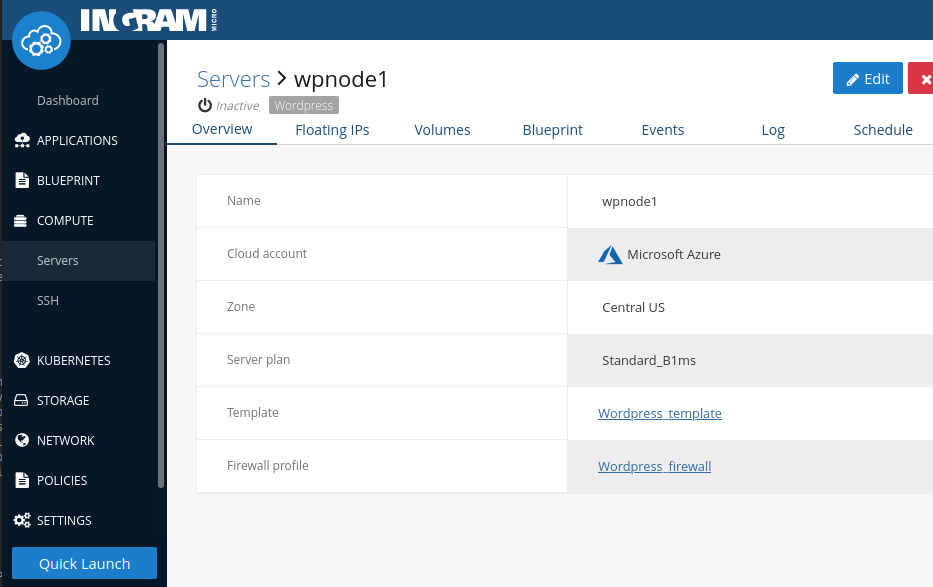

# IMCO CLI / Go Library

[](https://godoc.org/github.com/ingrammicro/cio)
[](https://codecov.io/github/ingrammicro/cio?branch=master)
[](https://travis-ci.org/ingrammicro/cio)
[](http://goreportcard.com/report/ingrammicro/cio)

Ingram Micro Cloud Orchestrator Command Line Interface (aka IMCO CLI) allows you to interact with IMCO features, and build your own scripts calling IMCO's API.

If you are already using IMCO CLI, and only want to obtain the latest version, download IMCO CLI from <https://github.com/ingrammicro/cio/releases/latest>

> NOTE: IMCO CLI is named as `cio` in terms of the binary and executable.

If you want to build the CLI using the source code, please, take into account that the master branch is the adequate one to be used for latest stable and published version of IMCO CLI.

## Table of Contents

- [Setup](#setup)
  - [Pre-requisites](#pre-requisites)
  - [Manual Setup](#manual-setup)
  - [Linux and OSX](#linux-and-osx)
    - [Configuration](#configuration)
    - [Binaries](#binaries)
  - [Environment variables](#environment-variables)
  - [Troubleshooting](#troubleshooting)
- [Usage](#usage)
  - [Wizard](#wizard)
    - [Wizard Use Case](#wizard-use-case)
  - [Blueprint](#blueprint)
    - [Blueprint Use Case](#blueprint-use-case)
      - [Template OS](#template-os)
      - [Cookbook versions](#cookbook-versions)
      - [Instantiate a server](#instantiate-a-server)
  - [Firewall Management](#firewall-management)
    - [Firewall Update Case](#firewall-update-case)
  - [Blueprint Update](#blueprint-update)
    - [Blueprint Update Case](#blueprint-update-case)
- [Contribute](#contribute)

## Setup

### Pre-requisites

Before setting up the CLI, you will need a IMCO account, and an API key associated with your account.

> NOTE: The API Endpoint server value depends on the targeted IMCO platform domain: <https://clients.{IMCO_DOMAIN}>

Once your account has been provisioned, we recommend you to follow the configuration guide indicated below: [manual setup](#manual-setup)

## Manual Setup

Use IMCO's Web UI to navigate the menus to `Settings` > `User Details` and scroll down until you find the `API Key` button.


Pressing `Create and download a new API key` will download a compressed file that contains the necessary files to authenticate with IMCO API and manage your infrastructure. `Keep it safe`.

Extract the contents with your zip compressor of choice and continue using the setup guide for your O.S.

## Linux and OSX

### Configuration
IMCO CLI configuration will usually be located in your personal folder under `.concerto`. If you are using root, CLI will look for configuration files under `/etc/cio`. We will assume that you are not root, so create the folder and drop the certificates to this location:

```bash
$ mkdir -p ~/.concerto/ssl/
$ unzip -x api-key.zip -d ~/.concerto/ssl
```

IMCO CLI expects a configuration file to be present containing:

- API Endpoint
- Log file
- Log level
- Certificate location

This command will generate the file `~/.concerto/client.xml` with suitable contents for most users:

```bash
$ cat <<EOF > ~/.concerto/client.xml
<concerto version="1.0" server="https://clients.{IMCO_DOMAIN}/v3/" log_file="/var/log/concerto-client.log" log_level="info">
 <ssl cert="$HOME/.concerto/ssl/cert.crt" key="$HOME/.concerto/ssl/private/cert.key" server_ca="$HOME/.concerto/ssl/ca_cert.pem" />
</concerto>
EOF
```

> NOTE: Please, remember to replace `{IMCO_DOMAIN}` with the right domain of your IMCO platform. At the same time, ensure to set the current API version: `v3`

We should have in your `.concerto` folder this structure:

```bash
$HOME/.concerto
├── client.xml
└── ssl
    ├── ca_cert.pem
    ├── cert.crt
    └── private
        └── cert.key
```

### Binaries

Download linux binaries for `Linux` or for `OSX` from <https://github.com/ingrammicro/cio/releases/latest> and place it in your path.

> NOTE: Please, remember to replace `{LATEST_RELEASE}` with the right tagged release.

Linux:

```bash
$ sudo curl -o /usr/local/bin/cio https://github.com/ingrammicro/cio/releases/download/{LATEST_RELEASE}/cio.amd64.linux
$ sudo chmod +x /usr/local/bin/cio
```

OSX:

```bash
$ sudo curl -o /usr/local/bin/cio https://github.com/ingrammicro/cio/releases/download/{LATEST_RELEASE}/cio.amd64.darwin
$ sudo chmod +x /usr/local/bin/cio
```

To test the binary execute `cio` without parameters

```bash
$ cio
NAME:
   cio - Manages communication between Host and IMCO Platform

USAGE:
   cio [global options] command [command options] [arguments...]

AUTHOR:
   Ingram Micro <https://github.com/ingrammicro/cio>

COMMANDS:
   blueprint, bl                   Manages blueprint commands for scripts, cookbook versions and templates
   brownfield, bf                  Manages brownfield resources, allowing users to discover and import servers, VPCs, floating IPs, volumes and policies from different cloud accounts into the system.
   cloud, clo                      Manages cloud related commands for server arrays, servers, generic images, ssh profiles, cloud providers, realms, server plans and infrastructure archives
   cloud-applications, ca          Manages cloud application templates -CATs- and deployments
   cloud-specific-extensions, cse  Manages cloud specific extensions -CSEs- templates and deployments
   events, ev                      Events allow the user to track their actions and the state of their servers
   kubernetes, k8s                 Manages kubernetes commands for clusters and node pools
   labels, lbl                     Provides information about labels
   network, net                    Manages network related commands
   settings, set                   Provides settings for cloud accounts and policies
   storage, st                     Manages storage commands for plans and volumes
   wizard, wiz                     Manages wizard related commands for apps, locations, cloud providers, server plans
...
```

To test that certificates are valid, and that we can communicate with IMCO server, obtain the list of cloud providers at your IMCO account using this command

```bash
$ cio cloud cloud-providers list
ID                         NAME                  
5da72f97588464053ffcb855   AWS                  
5da72f98588464053ffcb857   Microsoft Azure
```

## Environment variables

When using IMCO CLI you can override configuration parameters using the following environment variables:

| Env. Variable          | Description                                    |
|------------------------|------------------------------------------------|
| `CONCERTO_CA_CERT`     | CA certificate used with the API endpoint.     |
| `CONCERTO_CLIENT_CERT` | Client certificate used with the API endpoint. |
| `CONCERTO_CLIENT_KEY`  | Client key used with the API endpoint.         |
| `CONCERTO_CONFIG`      | Config file to be read by IMCO CLI.            |
| `CONCERTO_ENDPOINT`    | IMCO API endpoint.                             |
| `CONCERTO_URL`         | IMCO web site URL.                             |

## Troubleshooting

If you got an error executing IMCO CLI:

- execute `which cio` to make sure that the binary is installed.
- execute `ls -l /path/to/cio` with the output from the previous command, and check that you have execute permissions.
- execute `$PATH` and search for the path where `cio` is installed. If `cio` isn't in the path, move it to a `$PATH` location.
- check that your internet connection can reach `clients.{IMCO_DOMAIN}`.
- make sure that your firewall lets you access to <https://clients.{IMCO_DOMAIN}>.
- check that `client.xml` is pointing to the correct certificates' location.
- if `cio` executes but only shows server commands, you are probably trying to use `cio` from a commissioned server, and the configuration is being read from `/etc/cio`. If that's the case, you should leave `cio` configuration untouched so that server commands are available for our remote management.

## Usage

We include the most common use cases here. If you feel there is a missing a use case here, open a GitHub issue <https://github.com/ingrammicro/cio/issues/new>.

The resources can be organized using labels, a many-to-many relationship between labels and resources, based on User criteria and needs.

## Wizard

The Wizard command for IMCO CLI is the command line version of our `Quick launch server` in the IMCO's Web UI.


Wizard is the quickest way to install a well known stack in a cloud server. You can get an idea of what the wizard does using the command `cio wizard` without further subcommands:

```bash
$ cio wizard
NAME:
    - Manages wizard related commands for apps, locations, cloud providers, server plans

USAGE:
    command [command options] [arguments...]

COMMANDS:
    apps             Provides information about apps
    cloud-providers  Provides information about cloud providers
    locations        Provides information about locations
    server-plans     Provides information about server plans
...
```

IMCO CLI Wizard lets you select the application layer, the location, the cloud provider account for that location, and finally the hostname. IMCO CLI Wizard takes care of the details.

### Wizard Use Case

Let's type `cio wizard apps list` to check what applications we can instantiate as cloud servers using IMCO CLI wizard.

```bash
$ cio wizard apps list
ID                         NAME                 FLAVOUR_REQUIREMENTS                           GENERIC_IMAGE_ID           
6033af5b63648203278f6778   MongoDB              [architecture:x86_64 memory:2048]              5da72f9c588464053ffcb876   
6033af8e6364820345e2499a   Ubuntu 20.04         [architecture:x86_64]                          5f3281737e8b380531f1a5c0   
6033afbf636482036209736c   Wordpress            [architecture:x86_64 memory:2048]              5da72f9c588464053ffcb876   
6033b2da63648203b817d688   Ubuntu 18.04         [architecture:x86_64]                          5da72f9c588464053ffcb876   
6033b709f034c3004ef62cdb   Windows 2019         [architecture:x86_64 memory:4096 storage:40]   5e2491f92a9c6405447637b1   
6033b785f034c3006ad10d2b   Docker               [architecture:x86_64 memory:2048]              5da72f9c588464053ffcb876   
6033b7bdf034c30078315671   Joomla               [architecture:x86_64 memory:2048]              5da72f9c588464053ffcb876   
60d97b189c1004006e2b8de9   Ubuntu 18.04 arm64   [architecture:arm64 memory:1024]               609520351c93140124bac1fb   
60d97b2d9c10040097e2b6a5   Ubuntu 20.04 arm64   [architecture:arm64 memory:1024]               609520351c93140124bac1fc   
60ded3a6038daf008ab1d38b   Magento              [architecture:x86_64 memory:2048]              5da72f9c588464053ffcb876   
618b8790862c1b00d1b550fe   Red Hat 8 arm64      [architecture:arm64 memory:4096 storage:40]    609520351c93140124bac1fe   
618b8798862c1b00e6963928   Red Hat 8            [architecture:x86_64 memory:4096 storage:40]   609520351c93140124bac1fd
```

You can choose whatever application/stack is fine for your purpose, we choose `Wordpress`. Take note of the application identifier, `6033afbf636482036209736c` for `Wordpress`.

We will also need the location where we want our server to be instantiated. Execute `cio wizard locations list` to get the possible locations and its identifier.

```bash
$ cio wizard locations list
ID                         NAME            
5da72f9b588464053ffcb870   North America   
5da72f9b588464053ffcb871   Europe          
5da72f9b588464053ffcb872   Asia Pacific    
5da72f9b588464053ffcb873   South America   
609520351c93140124bac204   Africa          
609520351c93140124bac205   Middle East 
```

Take note of your preferred location. We will use `5da72f9b588464053ffcb870` for `North America`.

When using IMCO's Web UI, the wizard may take care of filtering appropriate cloud accounts for that provider and location. However, by using the CLI, it is the user's responsibility to choose a provider cloud account for that application/stack and location; and a server plan capable of instantiating the stack in that location. To show all possible cloud providers execute this command:

```bash
$ cio wizard cloud-providers list --app-id 6033afbf636482036209736c --location-id 5da72f9b588464053ffcb870
ID                         NAME                  
5da72f97588464053ffcb855   AWS                   
5da72f98588464053ffcb857   Microsoft Azure
```

It's necessary to retrieve the adequate Cloud Account ID for `Microsoft Azure` Cloud Provider, in our case `620a84f81376db00068f9598`. We will choose `Microsoft Azure`, whose ID is `5da72f98588464053ffcb857`:

```bash
$ cio settings cloud-accounts list
ID                         NAME              SUBSCRIPTION_ID            REMOTE_ID      CLOUD_PROVIDER_ID          CLOUD_PROVIDER_NAME   STATE          
620a84f81376db00068f9598   Microsoft Azure   620a84853a974d001aa32609                  5da72f98588464053ffcb857   Microsoft Azure       idle           
620a85091376db00068f959a   AWS               620a84853a974d001aa3260b                  5da72f97588464053ffcb855   AWS                   idle   
```

Now that we have all the data that we need, commission the server:

```bash
$ cio wizard apps deploy --id 6033afbf636482036209736c --location-id 5da72f9b588464053ffcb870 --cloud-account-id 620a84f81376db00068f9598 --hostname wpnode1
ID:                    620b61d27f8081000a9783b4
NAME:                  wpnode1
FQDN:                  
STATE:                 commissioning
PUBLIC_IP:             
PRIVATE_IP:            
TEMPLATE_ID:           620a8b5c3a974d0008a3260d
SERVER_PLAN_ID:        5da7301fa126060529b47c5e
CLOUD_ACCOUNT_ID:      620a84f81376db00068f9598
SSH_PROFILE_ID:        
SSH_PROFILE_IDS:       
BROWNFIELD_STATE:      Pure
FIREWALL_PROFILE_ID:   620a8b5d3a974d0008a32611
SERVER_ARRAY_ID:       
SUBNET_ID:             
VPC_ID:                
PRIVATENESS:           false
RESOURCE_TYPE:         server
LABELS:
```

We have a new server template with a commissioned server in IMCO.



Our server's ID is `620b61d27f8081000a9783b4`. We can now use `cio cloud servers` subcommands to manage the server.

Let's bring WordPress up:

```bash
$ cio cloud servers boot --id 620b61d27f8081000a9783b4
ID:                    620b61d27f8081000a9783b4
NAME:                  wpnode1
FQDN:                  
STATE:                 booting
PUBLIC_IP:             
PRIVATE_IP:            
TEMPLATE_ID:           620a8b5c3a974d0008a3260d
SERVER_PLAN_ID:        5da7301fa126060529b47c5e
CLOUD_ACCOUNT_ID:      620a84f81376db00068f9598
SSH_PROFILE_ID:        
SSH_PROFILE_IDS:       
BROWNFIELD_STATE:      Pure
FIREWALL_PROFILE_ID:   620a8b5d3a974d0008a32611
SERVER_ARRAY_ID:       
SUBNET_ID:             
VPC_ID:                
PRIVATENESS:           false
RESOURCE_TYPE:         server
LABELS:                Wordpress
```

Server status: `Bootstraping`:

```bash
$ cio cloud servers show --id 620b61d27f8081000a9783b4
ID:                    620b61d27f8081000a9783b4
NAME:                  wpnode1
FQDN:                  s3ef8ed2ba4407b8.centralus.cloudapp.azure.com
STATE:                 bootstrapping
PUBLIC_IP:             52.165.165.245
PRIVATE_IP:            10.0.0.4
TEMPLATE_ID:           620a8b5c3a974d0008a3260d
SERVER_PLAN_ID:        5da7301fa126060529b47c5e
CLOUD_ACCOUNT_ID:      620a84f81376db00068f9598
SSH_PROFILE_ID:        
SSH_PROFILE_IDS:       
BROWNFIELD_STATE:      Pure
FIREWALL_PROFILE_ID:   620a8b5d3a974d0008a32611
SERVER_ARRAY_ID:       
SUBNET_ID:             
VPC_ID:                
PRIVATENESS:           false
RESOURCE_TYPE:         server
LABELS:                Wordpress
```


Server status: `Operational`:

```bash
$ cio cloud servers show --id 620b61d27f8081000a9783b4
ID:                    620b61d27f8081000a9783b4
NAME:                  wpnode1
FQDN:                  s3ef8ed2ba4407b8.centralus.cloudapp.azure.com
STATE:                 operational
PUBLIC_IP:             52.165.165.245
PRIVATE_IP:            10.0.0.4
TEMPLATE_ID:           620a8b5c3a974d0008a3260d
SERVER_PLAN_ID:        5da7301fa126060529b47c5e
CLOUD_ACCOUNT_ID:      620a84f81376db00068f9598
SSH_PROFILE_ID:        
SSH_PROFILE_IDS:       
BROWNFIELD_STATE:      Pure
FIREWALL_PROFILE_ID:   620a8b5d3a974d0008a32611
SERVER_ARRAY_ID:       
SUBNET_ID:             
VPC_ID:                
PRIVATENESS:           false
RESOURCE_TYPE:         server
LABELS:                Wordpress

```


After a brief amount of time you will have your new `Wordpress` server up and running, ready to be configured.


## Blueprint

IMCO blueprints are the compendium of:

- cookbook-versions, they map to IMCO's Web UI cookbooks. Use `cio blueprint cookbook-versions list` to show all cookbooks available at your account.
- scripts, they provide a way to execute custom scripts after bootstrapping, before a clean shutdown, or on demand.
- attachments, provides attachments to store on the servers.
- templates, an ordered combination of cookbook-versions and scripts.

### Blueprint Use Case

A template must be created with an OS target, a cookbook-versions list, and a list of custom attributes for those cookbooks.

#### Template OS

Blueprints are associated with an Operative System, and each cloud provider has a different way of identifying the OS that a machine is running.

IMCO takes care of the gap, and lets you select a cloud provider independent OS, and find out later which image is appropriate for the chosen cloud provider account and location. Hence, blueprints are bound to OS, but cloud provider and location independent.

For our case we will be using `Ubuntu 20.04 Focal Fossa x86_64`. Let's find its IMCO ID:

```bash
$ cio cloud generic-images list
ID                         NAME
5da72f9c588464053ffcb878   Windows 2016 x86_64
5e2491f92a9c6405447637b1   Windows 2019 x86_64
5da72f9c588464053ffcb876   Ubuntu 18.04 Bionic Beaver x86_64
609520351c93140124bac1fb   Ubuntu 18.04 Bionic Beaver arm64
5f3281737e8b380531f1a5c0   Ubuntu 20.04 Focal Fossa x86_64
609520351c93140124bac1fc   Ubuntu 20.04 Focal Fossa arm64
609520351c93140124bac1fd   Red Hat Enterprise Linux 8 x86_64
609520351c93140124bac1fe   Red Hat Enterprise Linux 8 arm64
609520351c93140124bac1ff   CentOS 8 x86_64
609520351c93140124bac200   CentOS 8 arm64
5da72f9c588464053ffcb87b   Debian 9 x86_64
609520351c93140124bac201   Debian 10 x86_64
609520351c93140124bac202   Debian 10 arm64
```

Take note of `Ubuntu 20.04 Focal Fossa x86_64` ID, `5f3281737e8b380531f1a5c0`.

#### Cookbook versions

We want to use IMCO's curated Joomla cookbook. Use `cio blueprint cookbook-versions` to find the cookbooks to add.

```bash
$ cio blueprint cookbook-versions list | awk 'NR==1 || /joomla/'
ID                         NAME             VERSION        STATE          REVISION_ID                                DESCRIPTION                                                                       LABELS         
5da72fc3588464054f87d7c8   joomla           0.11.1         ready          161a5d9c95e4c54b9b1a51135907323752a2321e   Installs/Configures joomla environment                                            []             
6023c920ec7c3f0019028d60   joomla           0.11.2         ready          ec2b9eea4c5a39759eca1dea67645d536e939070   Installs/Configures joomla environment                                            [] 
```

Joomla curated cookbooks creates a local mysql database. We only have to tell our cookbook that we should override the `joomla.db.hostname` to `127.0.0.1`. Execute the following command to create the Joomla template.

```bash
$ cio blueprint templates create --name joomla-tmplt --generic-image-id 5f3281737e8b380531f1a5c0 --cookbook-versions "joomla:0.11.2" --configuration-attributes '{"joomla":{"db":{"hostname":"127.0.0.1"}}}' --labels Joomla,mysite.com
ID:                         620b7d357f8081000a9783e0
NAME:                       joomla-tmplt
GENERIC_IMAGE_ID:           5f3281737e8b380531f1a5c0
RUN_LIST:                   
CONFIGURATION_ATTRIBUTES:   {"joomla":{"db":{"hostname":"127.0.0.1"}}}
RESOURCE_TYPE:              template
COOKBOOK_VERSIONS:          joomla:0.11.2
STATE:                      compiling
LABELS:                     Joomla,mysite.com
```

#### Instantiate a server

Now that we have our server blueprint defined, let's start one. Servers in IMCO need to know the server plan for the cloud provider and realm, and the template used to build the instance.

As we did in the Wizard use case, we can find the missing data using these commands:

##### Find cloud provider server plan

```bash
$ cio cloud cloud-providers list
ID                         NAME                  
5da72f97588464053ffcb855   AWS                  
5da72f98588464053ffcb857   Microsoft Azure
```

##### Select a realm by cloud provider

```bash
$ cio cloud realms list --id 5da72f98588464053ffcb857
ID                         NAME                   LOCATION_ID                CLOUD_PROVIDER_ID          PROVIDER_NAME        
5da73014a126060529b47b1e   East Asia              5da72f9b588464053ffcb872   5da72f98588464053ffcb857   eastasia             
5da73019a126060529b47bba   Southeast Asia         5da72f9b588464053ffcb872   5da72f98588464053ffcb857   southeastasia        
5da7301da126060529b47c25   Central US             5da72f9b588464053ffcb870   5da72f98588464053ffcb857   centralus            
5da73022a126060529b47cb1   East US                5da72f9b588464053ffcb870   5da72f98588464053ffcb857   eastus               
5da73027a126060529b47d42   East US 2              5da72f9b588464053ffcb870   5da72f98588464053ffcb857   eastus2              
5da7302aa126060529b47db3   West US                5da72f9b588464053ffcb870   5da72f98588464053ffcb857   westus               
5da73030a126060529b47e5c   North Central US       5da72f9b588464053ffcb870   5da72f98588464053ffcb857   northcentralus       
5da73035a126060529b47ef3   South Central US       5da72f9b588464053ffcb870   5da72f98588464053ffcb857   southcentralus       
5da7303ba126060529b47fae   North Europe           5da72f9b588464053ffcb871   5da72f98588464053ffcb857   northeurope          
5da7303fa126060529b4801d   West Europe            5da72f9b588464053ffcb871   5da72f98588464053ffcb857   westeurope           
5da73044a126060529b480af   Japan West             5da72f9b588464053ffcb872   5da72f98588464053ffcb857   japanwest            
5da7304aa126060529b4814d   Japan East             5da72f9b588464053ffcb872   5da72f98588464053ffcb857   japaneast            
5da7304da126060529b481b4   Brazil South           5da72f9b588464053ffcb873   5da72f98588464053ffcb857   brazilsouth          
5da73052a126060529b48250   Australia East         5da72f9b588464053ffcb872   5da72f98588464053ffcb857   australiaeast        
5da73058a126060529b48301   Australia Southeast    5da72f9b588464053ffcb872   5da72f98588464053ffcb857   australiasoutheast   
5da7305ea126060529b4839f   UK South               5da72f9b588464053ffcb871   5da72f98588464053ffcb857   uksouth              
5da73062a126060529b4840e   UK West                5da72f9b588464053ffcb871   5da72f98588464053ffcb857   ukwest               
5da73068a126060529b484a4   West US 2              5da72f9b588464053ffcb870   5da72f98588464053ffcb857   westus2              
5e282b7967b583057691831a   West Central US        5da72f9b588464053ffcb870   5da72f98588464053ffcb857   westcentralus        
60366c4209db430014510528   Germany West Central   5da72f9b588464053ffcb871   5da72f98588464053ffcb857   germanywestcentral   
609181bcf536d200201cba1e   South Africa North     609520351c93140124bac204   5da72f98588464053ffcb857   southafricanorth     
609181d3f536d200201cbbe8   Central India          5da72f9b588464053ffcb872   5da72f98588464053ffcb857   centralindia         
60918244f536d200201cc004   Korea Central          5da72f9b588464053ffcb872   5da72f98588464053ffcb857   koreacentral         
60918266f536d200201cc2a3   Canada Central         5da72f9b588464053ffcb870   5da72f98588464053ffcb857   canadacentral        
60918286f536d200201cc530   France Central         5da72f9b588464053ffcb871   5da72f98588464053ffcb857   francecentral        
609182b7f536d200201cc8fb   Norway East            5da72f9b588464053ffcb871   5da72f98588464053ffcb857   norwayeast           
609182d0f536d200201ccaf7   Switzerland North      5da72f9b588464053ffcb871   5da72f98588464053ffcb857   switzerlandnorth     
609182eaf536d200201cccf3   UAE North              609520351c93140124bac205   5da72f98588464053ffcb857   uaenorth             
60918388f536d200201cd559   Australia Central      5da72f9b588464053ffcb872   5da72f98588464053ffcb857   australiacentral     
609183ebf536d200201cd8e8   Korea South            5da72f9b588464053ffcb872   5da72f98588464053ffcb857   koreasouth           
60918405f536d200201cdaf7   South India            5da72f9b588464053ffcb872   5da72f98588464053ffcb857   southindia           
60918434f536d200201cde95   Canada East            5da72f9b588464053ffcb870   5da72f98588464053ffcb857   canadaeast
```

We want to use provider `Microsoft Azure` with ID `5da72f98588464053ffcb857`, realm `North Central US` with ID `5da73030a126060529b47e5c` and filtering by server plan `Basic_A0`

```bash
$ cio cloud server-plans list --cloud-provider-id 5da72f98588464053ffcb857 --realm-id 5da73030a126060529b47e5c | awk 'NR==1 || /Basic_A0/'
ID                         NAME       MEMORY   CPUS  STORAGE   LOCATION_ID                LOCATION_NAME   REALM_ID                   REALM_PROVIDER_NAME   FLAVOUR_PROVIDER_NAME   CLOUD_PROVIDER_ID          CLOUD_PROVIDER_NAME   
5da73030a126060529b47e65   Basic_A0   768      1     20        5da72f9b588464053ffcb870   North America   5da73030a126060529b47e5c   northcentralus        Basic_A0                5da72f98588464053ffcb857   Microsoft Azure
```

##### Find Template ID

We already know our template ID, but in case you want to make sure

```bash
$ cio blueprint templates list
ID                         NAME                 GENERIC_IMAGE_ID           LABELS                
620a8b5c3a974d0008a3260d   Wordpress_template   5da72f9c588464053ffcb876   [Wordpress]           
620b7d357f8081000a9783e0   joomla-tmplt         5f3281737e8b380531f1a5c0   [Joomla mysite.com]   

```

##### Find Location ID

We already know our location ID, but in case you want to make sure

```bash
$ cio wizard locations list
ID                         NAME            
5da72f9b588464053ffcb870   North America   
5da72f9b588464053ffcb871   Europe          
5da72f9b588464053ffcb872   Asia Pacific    
5da72f9b588464053ffcb873   South America   
609520351c93140124bac204   Africa          
609520351c93140124bac205   Middle East
```

##### Find Cloud Account ID

It's necessary to retrieve the adequate Cloud Account ID for `Microsoft Azure` Cloud Provider, in our case `5da72f98588464053ffcb857`:

```bash
$ cio settings cloud-accounts list
ID                         NAME              SUBSCRIPTION_ID            REMOTE_ID      CLOUD_PROVIDER_ID          CLOUD_PROVIDER_NAME   STATE          
620a84f81376db00068f9598   Microsoft Azure   620a84853a974d001aa32609                  5da72f98588464053ffcb857   Microsoft Azure       idle           
620a85091376db00068f959a   AWS               620a84853a974d001aa3260b                  5da72f97588464053ffcb855   AWS                   idle
```

##### Find SSH Profile ID

It's necessary to retrieve the adequate SSH Profile ID. It can be created using CLI commands or IMCO UI.

```bash
$ cio cloud ssh-profiles list
ID                         NAME                 PUBLIC_KEY                   LABELS
620b97b93700550006ce0066   default              ssh-rsa AAAAB3NzaC1yc[...]   []
620b98013700550006ce0068   Joomla SSH           ssh-rsa AAAABBfD4Klmn[...]   [mysite.com Joomla]
[...]
```

##### Find Firewall Profile ID

It's necessary to retrieve the adequate Firewall Profile ID. It can be created using CLI commands or IMCO UI.

```bash
$ cio network firewall-profiles list
ID                         NAME                 DESCRIPTION                                            DEFAULT        LABELS
620a73973a974d001aa325f9   Default firewall     Firewall profile created by the platfom for your use   true           []           
620b98783700550006ce006a   Joomla Firewall      Firewall profile created for joomla management         false          [Joomla mysite.com]
[...]
```

##### Create our Joomla Server

```bash
$ cio cloud servers create --name joomla-node1 --template-id 620b7d357f8081000a9783e0 --server-plan-id 5da73030a126060529b47e65 --cloud-account-id 620a84f81376db00068f9598 --ssh-profile-id 620b98013700550006ce0068 --firewall-profile-id 620b98783700550006ce006a --labels Joomla,mysite.com
ID:                    620b992e7f8081000a9783e5
NAME:                  joomla-node1
FQDN:                  
STATE:                 commissioning
PUBLIC_IP:             
PRIVATE_IP:            
TEMPLATE_ID:           620b7d357f8081000a9783e0
SERVER_PLAN_ID:        5da73030a126060529b47e65
CLOUD_ACCOUNT_ID:      620a84f81376db00068f9598
SSH_PROFILE_ID:        620b98013700550006ce0068
SSH_PROFILE_IDS:       620b98013700550006ce0068
BROWNFIELD_STATE:      Pure
FIREWALL_PROFILE_ID:   620b98783700550006ce006a
SERVER_ARRAY_ID:       
SUBNET_ID:             
VPC_ID:                
PRIVATENESS:           false
RESOURCE_TYPE:         server
LABELS:                Joomla,mysite.com
```

And finally boot it:

```bash
$ cio cloud servers boot --id 620b992e7f8081000a9783e5
ID:                    620b992e7f8081000a9783e5
NAME:                  joomla-node1
FQDN:                  
STATE:                 booting
PUBLIC_IP:             
PRIVATE_IP:            
TEMPLATE_ID:           620b7d357f8081000a9783e0
SERVER_PLAN_ID:        5da73030a126060529b47e65
CLOUD_ACCOUNT_ID:      620a84f81376db00068f9598
SSH_PROFILE_ID:        620b98013700550006ce0068
SSH_PROFILE_IDS:       620b98013700550006ce0068
BROWNFIELD_STATE:      Pure
FIREWALL_PROFILE_ID:   620b98783700550006ce006a
SERVER_ARRAY_ID:       
SUBNET_ID:             
VPC_ID:                
PRIVATENESS:           false
RESOURCE_TYPE:         server
LABELS:                Joomla,mysite.com
```

You can retrieve the current status of the server and see how it transitions along different statuses (booting, bootstrapping, operational). Then, after a brief amount of time the final status is reached:

```bash
$ cio cloud servers show --id 620b992e7f8081000a9783e5
ID:                    620b992e7f8081000a9783e5
NAME:                  joomla-node1
FQDN:                  s0f2a626f0824baa.northcentralus.cloudapp.azure.com
STATE:                 operational
PUBLIC_IP:             23.101.162.162
PRIVATE_IP:            10.0.0.4
TEMPLATE_ID:           620b7d357f8081000a9783e0
SERVER_PLAN_ID:        5da73030a126060529b47e65
CLOUD_ACCOUNT_ID:      620a84f81376db00068f9598
SSH_PROFILE_ID:        620b98013700550006ce0068
SSH_PROFILE_IDS:       620b98013700550006ce0068
BROWNFIELD_STATE:      Pure
FIREWALL_PROFILE_ID:   620b98783700550006ce006a
SERVER_ARRAY_ID:       
SUBNET_ID:             
VPC_ID:                
PRIVATENESS:           false
RESOURCE_TYPE:         server
LABELS:                Joomla,mysite.com
```

## Firewall Management

IMCO CLI's `network` command lets you manage a network settings at the server scope.

As we have done before, execute this command with no further commands to get usage information:

```bash
NAME:
    - Manages network related commands

USAGE:
    command [command options] [arguments...]

COMMANDS:
    firewall-profiles  Provides information about firewall profiles
    floating-ips       Provides information about floating IPs
    load-balancers     Provides information about load balancers
    vpcs               Provides information about Virtual Private Clouds (VPCs)
    subnets            Provides information about VPC Subnets
    vpns               Provides information about VPC Virtual Private Networks (VPNs)
    dns-domains        Provides information about DNS domains and records
...
```

As you can see, you can manage firewall from IMCO CLI.

### Firewall Update Case

Servers in IMCO are always associated with a firewall profile. By default, ports 443 and 80 are open to fit most web environments, but if you are not using those ports but some others. We would need to close HTTP and HTTPS ports and open LDAP and LDAPS instead.

The first thing we will need is our server's related firewall identifier. In this they can be found filtering by label assigned 'LDAP':

```bash
$ cio cloud servers list --labels LDAP
ID                         NAME           FQDN                                           STATE          PUBLIC_IP       PRIVATE_IP     TEMPLATE_ID                SERVER_PLAN_ID             CLOUD_ACCOUNT_ID           SSH_PROFILE_ID             SSH_PROFILE_IDS              BROWNFIELD_STATE   FIREWALL_PROFILE_ID        LABELS         
620bab883700550006ce007d   openldap-1                                                    inactive                                      620bab0a3700550006ce0076   5da73030a126060529b47e67   620a84f81376db00068f9598   620b97b93700550006ce0066   [620b97b93700550006ce0066]   Pure               620ba0fe3700550006ce0071   [LDAP]         
620baff53700550006ce0093   openldap-2     sopenldap2.northcentralus.cloudapp.azure.com   operational    52.252.224.48   10.0.0.5       620bab0a3700550006ce0076   5da73031a126060529b47e68   620a84f81376db00068f9598   620b97b93700550006ce0066   [620b97b93700550006ce0066]   Pure               620ba0fe3700550006ce0071   [LDAP] 
```

Now that we have the firewall profile ID, list its contents

```bash
$ cio network firewall-profiles show --id 620ba0fe3700550006ce0071
ID:              620ba0fe3700550006ce0071
NAME:            Firewall LDAP
DESCRIPTION:     LDAP Services firewall
DEFAULT:         false
RULES:           TCP/22-22:any,TCP/5985-5985:any,TCP/3389-3389:any,TCP/443-443:any,TCP/80-80:any
RESOURCE_TYPE:   firewall_profile
LABELS:          LDAP
```

The first three values are ports that IMCO may use to keep the desired state of the machine, and that will always be accessed using certificates.

When updating, we tell IMCO a new set of rules. Beware of adding previous rules, update will replace existing items with the ones provided. Execute the following command to open 389 and 686 to anyone. 

```bash
$ cio network firewall-profiles update --id 620ba0fe3700550006ce0071 --rules TCP/22-22:any,TCP/5985-5985:any,TCP/3389-3389:any,TCP/443-443:any,TCP/80-80:any,TCP/389-389:any,TCP/636-636:any 
ID:              620ba0fe3700550006ce0071
NAME:            Firewall LDAP
DESCRIPTION:     LDAP Services firewall
DEFAULT:         false
RULES:           TCP/22-22:any,TCP/5985-5985:any,TCP/3389-3389:any,TCP/443-443:any,TCP/80-80:any,TCP/389-389:any,TCP/636-636:any
RESOURCE_TYPE:   firewall_profile
LABELS:          LDAP
```

Firewall update returns the complete set of rules. As you can see, now LDAP and LDAPS ports are open.

## Blueprint Update

We have already used [blueprints](#blueprint) before. So you might already know that we can delete and update blueprints.

### Blueprint Update Case

Let's pretend there is an existing Joomla blueprint, and that we want to update the previous password to a safer one.

This is the Joomla blueprint that we created in a previous use case.

```bash
$ cio blueprint templates show --id 620b7d357f8081000a9783e0
ID:                         620b7d357f8081000a9783e0
NAME:                       joomla-tmplt
GENERIC_IMAGE_ID:           5f3281737e8b380531f1a5c0
RUN_LIST:                   
CONFIGURATION_ATTRIBUTES:   {"joomla":{"db":{"hostname":"127.0.0.1"}}}
RESOURCE_TYPE:              template
COOKBOOK_VERSIONS:          joomla:0.11.2
STATE:                      ready
LABELS:                     mysite.com,Joomla
```

Beware of adding previous cookbook versions or configuration attributes. Update will replace existing items with the ones provided. If we don't want to lose the `joomla.db.hostname` attribute, add it to our configuration attributes parameter:

```bash
$ cio blueprint templates update --id 620b7d357f8081000a9783e0 --configuration-attributes '{"joomla":{"db":{"hostname":"127.0.0.1", "password":"$afeP4sSw0rd"}}}'
ID:                         620b7d357f8081000a9783e0
NAME:                       joomla-tmplt
GENERIC_IMAGE_ID:           5f3281737e8b380531f1a5c0
RUN_LIST:                   
CONFIGURATION_ATTRIBUTES:   {"joomla":{"db":{"hostname":"127.0.0.1","password":"$afeP4sSw0rd"}}}
RESOURCE_TYPE:              template
COOKBOOK_VERSIONS:          joomla:0.11.2
STATE:                      ready
LABELS:                     Joomla,mysite.com
```

As you can see, non specified parameters, like name and cookbook version list, remain unchanged. Let's now change the cookbook version list, adding two cookbooks.

```bash
$ cio blueprint templates update --id 620b7d357f8081000a9783e0 --cookbook-versions "joomla:0.11.2,sa-python:0.0.3,polipo:0.1.0"
ID:                         620b7d357f8081000a9783e0
NAME:                       joomla-tmplt
GENERIC_IMAGE_ID:           5f3281737e8b380531f1a5c0
RUN_LIST:                   
CONFIGURATION_ATTRIBUTES:   {"joomla":{"db":{"hostname":"127.0.0.1","password":"$afeP4sSw0rd"}}}
RESOURCE_TYPE:              template
COOKBOOK_VERSIONS:          joomla:0.11.2,polipo:0.1.0,sa-python:0.0.3
STATE:                      compiling
LABELS:                     mysite.com,Joomla
```

Of course, we can change cookbook versions list and configuration attributes in one command.

```bash
$ cio blueprint templates update --id 620b7d357f8081000a9783e0 --configuration-attributes '{"joomla":{"db":{"hostname":"127.0.0.1", "password":"$afeP4sSw0rd"}}}' --cookbook-versions "joomla:0.11.2,sa-python:0.0.3,polipo:0.1.0"
ID:                         620b7d357f8081000a9783e0
NAME:                       joomla-tmplt
GENERIC_IMAGE_ID:           5f3281737e8b380531f1a5c0
RUN_LIST:                   
CONFIGURATION_ATTRIBUTES:   {"joomla":{"db":{"hostname":"127.0.0.1","password":"$afeP4sSw0rd"}}}
RESOURCE_TYPE:              template
COOKBOOK_VERSIONS:          joomla:0.11.2,polipo:0.1.0,sa-python:0.0.3
STATE:                      ready
LABELS:                     Joomla,mysite.com
```

## Contribute

To contribute

- Find and open issue, or report a new one. Include proper information about the environment, at least: operating system, CLI version, steps to reproduce the issue and related issues. Avoid writing multi-issue reports, and make sure that the issue is unique.
- Fork the repository to your account.
- Commit scoped chunks, adding concise and clear comments.
- Remember to add tests to your contributed code.
- Push changes to the forked repository.
- Submit the PR to IMCO CLI.
- Let the maintainers give you the LGTM.

Please, use gofmt, golint, go vet, and follow [go style](https://github.com/golang/go/wiki/CodeReviewComments) advices
